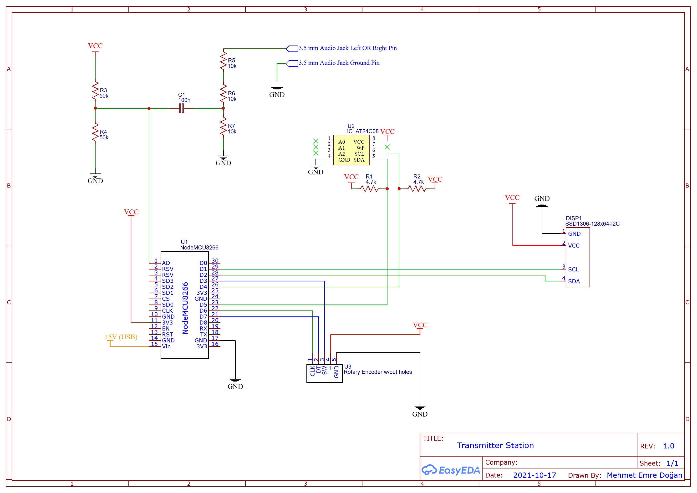
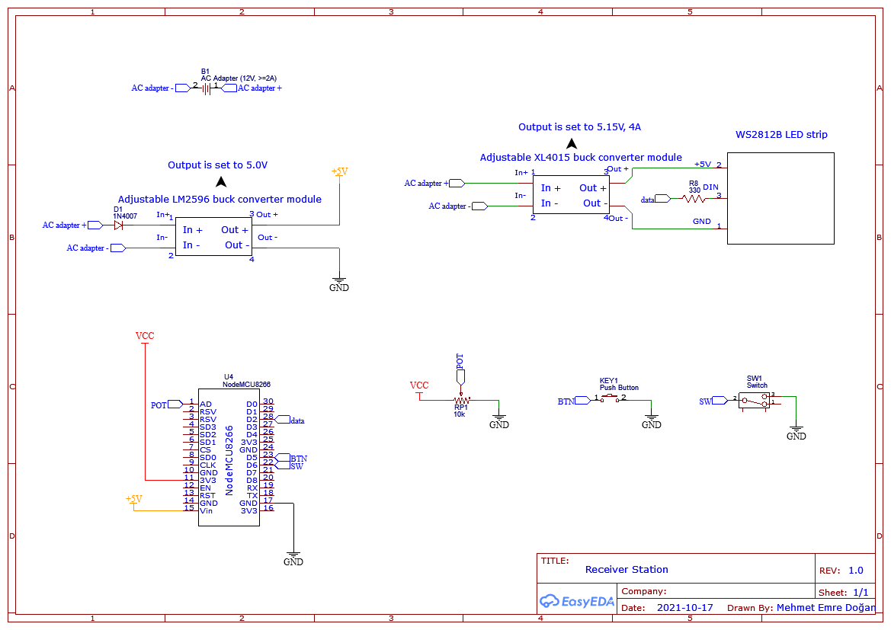
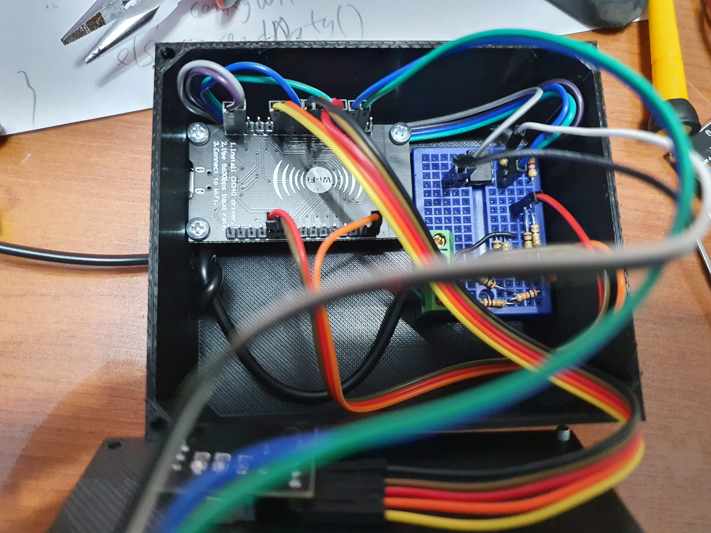
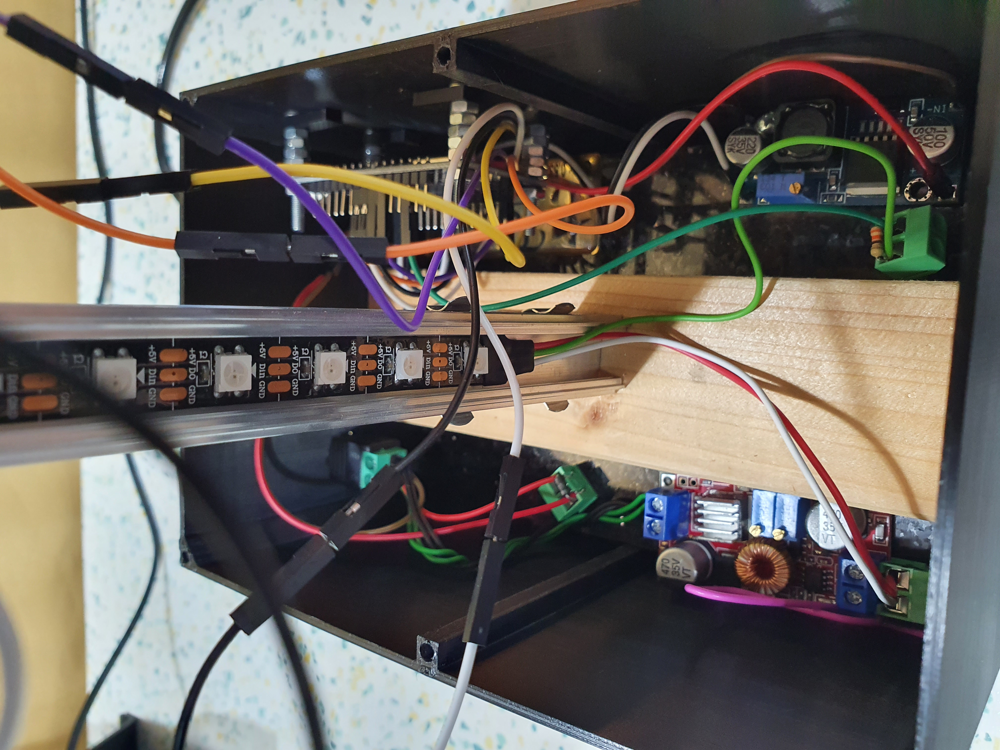
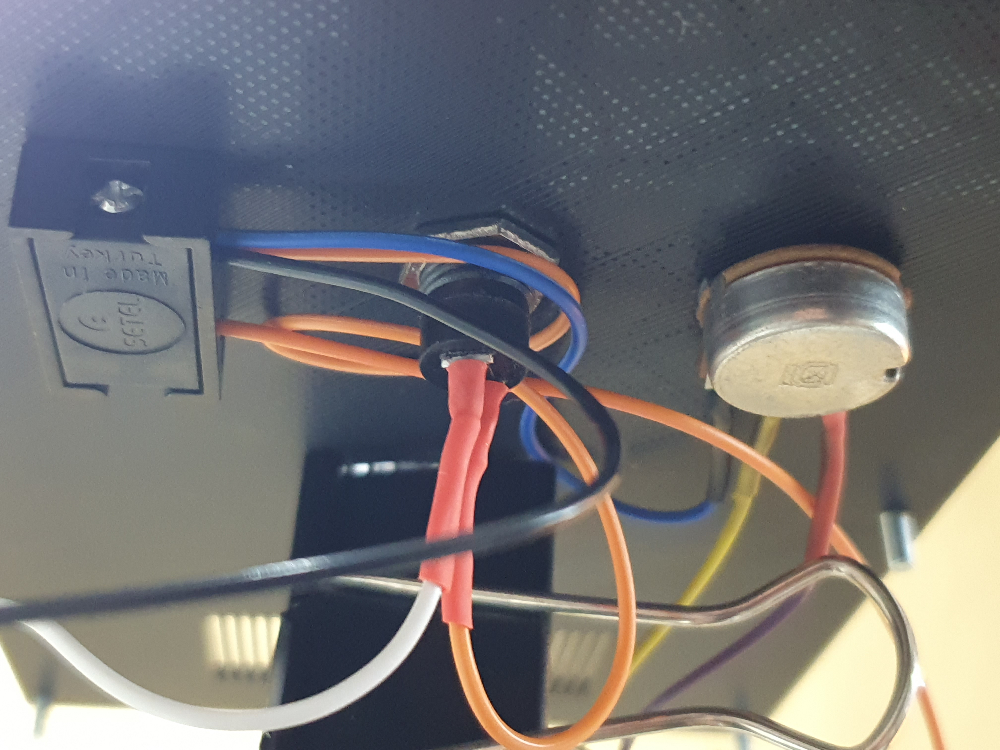
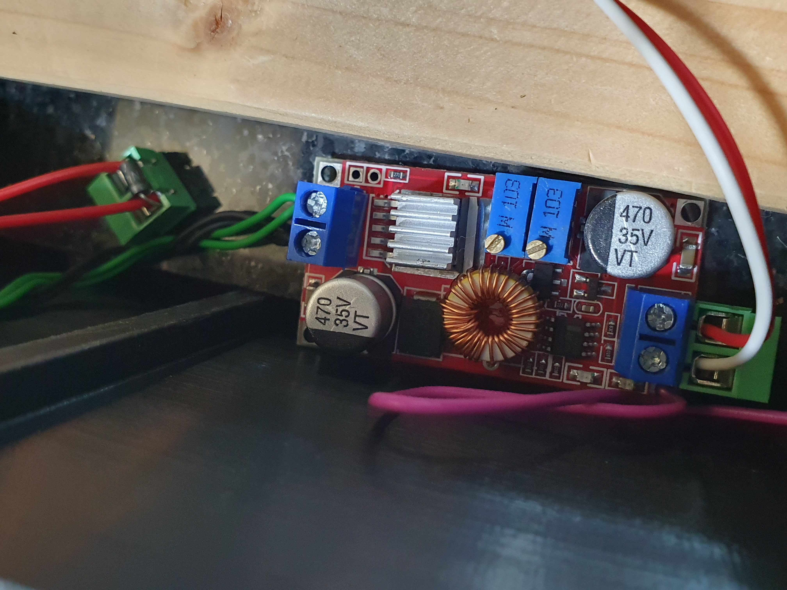
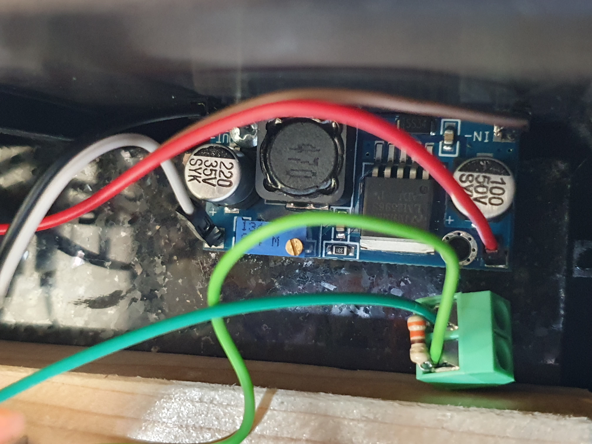
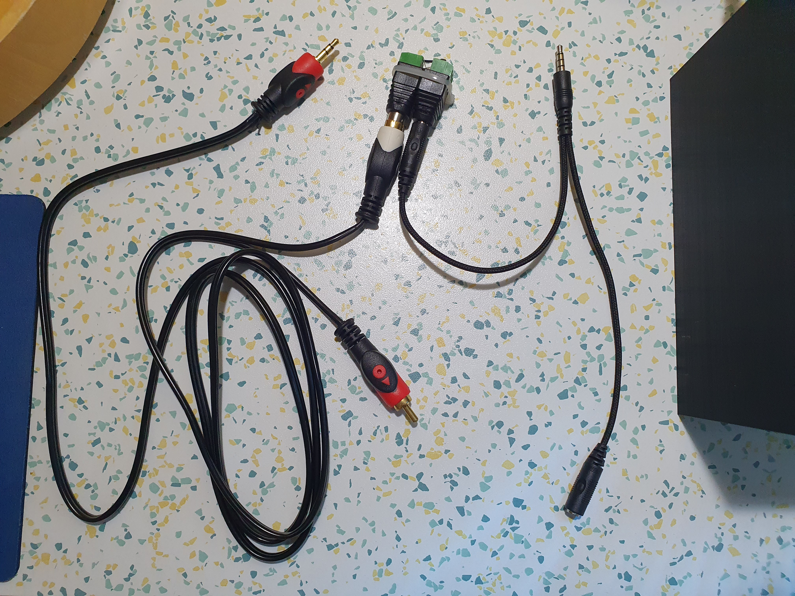
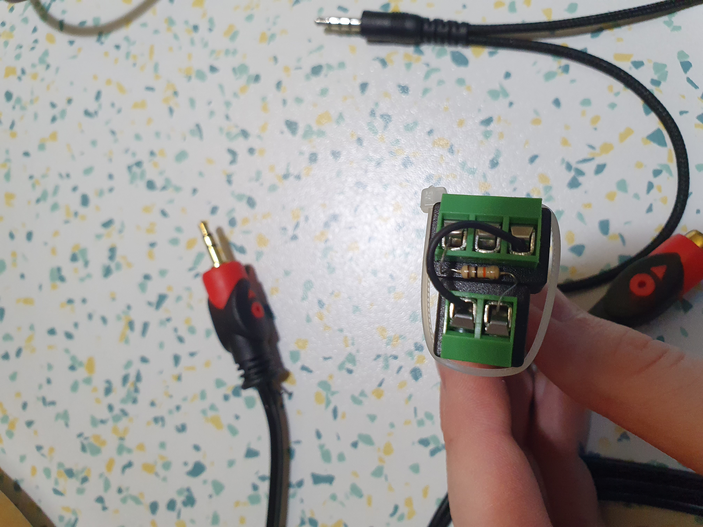

# wirelessMusicVisualizer
Using two node MCU ESP8266 modules and addressable RGB LED strip, visualize the music, display animated flags, brighten the darkness (with the help torch and emergency torch modes) and evem it is Adalight compatible. Therefore, you can use it with any kind of Adalight compatible software, such as [Prismatik Unofficial](https://github.com/psieg/Lightpack)

## Necessary Libraries
Please install the libraries below if you have not done yet.
- [Fastled library](https://github.com/FastLED/FastLED)
- [Adafruit GFX library](https://github.com/adafruit/Adafruit-GFX-Library)
- [Adafruit SSD1306 library](https://github.com/adafruit/Adafruit_SSD1306)
- [SoftwareI2C library](https://github.com/Seeed-Studio/Arduino_Software_I2C)

## Schematics
### Transmitter

### Receiver

## Pictures

### Transmitter
#### Inside of the transmitter station

#### Transmitter station lid

### Receiver
#### Inside of the receiver station

#### Receiver station lid

#### Adjustable XL4015 step down converter module

#### Adjustable LM2596 step down converter module

### Recording setup
The setup to record line output of the PC with any mobile phone.
There is a 10 kOhm resistor between any signal ouput channel, left or right, to mobile phone microhone input.

#### Y cable to split recording setup and my poject (transmitter station + headphones)

#### Recording setup

#### 10 kOhm resistor close up

