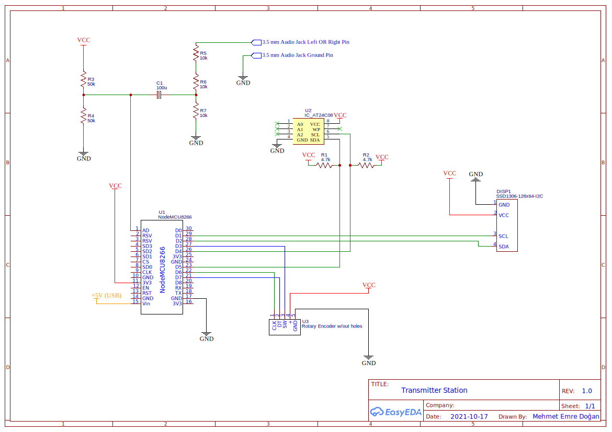
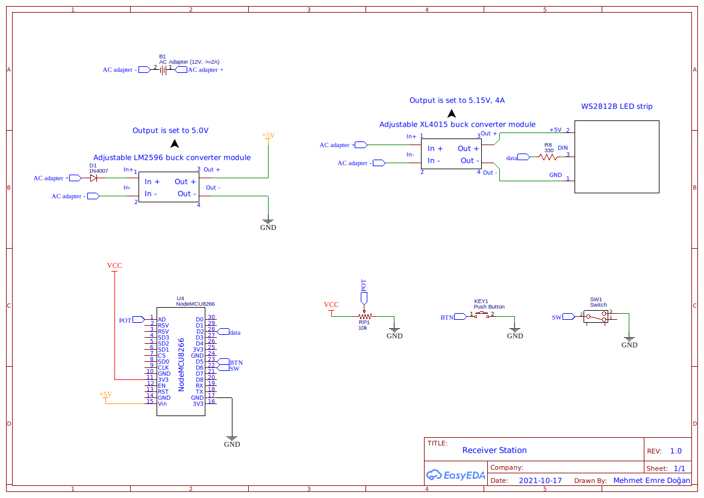

# wirelessMusicVisualizer
Using two node MCU ESP8266 modules and addressable RGB LED strip, visualize the music, display animated flags, and more.
## Pictures
### Transmitter

### Receiver

## Schematics
### Transmitter

### Receiver
