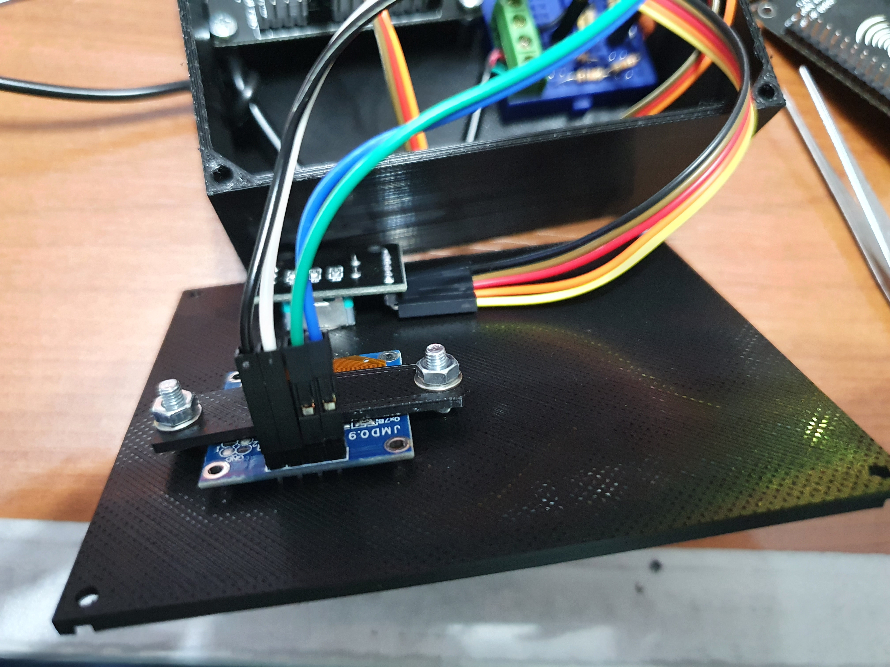

# wirelessMusicVisualizer
Using two node MCU ESP8266 modules and addressable RGB LED strip, visualize the music, display animated flags, brighten the darkness (with the help of torch and emergency torch modes), and even Adalight compatible. Therefore, you can use it with any kind of Adalight compatible software, such as [Prismatik Unofficial](https://github.com/psieg/Lightpack)

# Abstract
**Purpose**: Measure the voltage level of the sound output of a device, i.e., computer, and send it to the receiver LED module via UDP protocol to visualize music.

##**Features**:
- Ability to change the used wi-fi channel to keep away interference
- Capable of saving the current configuration to external I2C EEPROM to avoid adjusting the settings on each boot
- Different colors and visualizing modes
- Software restart mode for transmitter
- Very low latency (no noticeable lag even with listening to music with wired headphones)

##**Other Operating Modes**:
- Flag colored flowing light
- Ambiance light changing color according to the seen video on the computer screen
- Emergency light (with different tones of white)

##**Notes**:
- Both transmitter and receiver stations’ CPU frequency is set to 160 MHz to increase stability and smoothness
- Due to the nature of the UDP, sometimes packet drops occur. If the packet drops are incredibly high, changing the wi-fi channel is required. 

## Videos & Gifs of the project

</img>
 

 
The real project looks way smoother than the gif. You may watch the YouTube videos to see that. In fact, the actual refresh rate of the project is nearly 100 Hz; however, YouTube supports only up to 60 fps, and the gif is unfortunately only 30 fps.
 

- Please watch the [complete demonstration video](https://www.youtube.com/watch?v=xi880eUqIho) on YouTube.
- You may also want to watch my [playlist](https://www.youtube.com/playlist?list=PLV24y8ZhNEglrx4vv8YyNaVGACWpZlcM2) consisting of uncopyrighted music visualized by this project.

## Features
### Music visualization (Transmitter required)
- Smooth bar music visualizer in different color modes (steady gradient, flowing gradient, color shifting)
- Fast bar visualizer
- Brightness changing visualizer
- Optional music indicator and seconds indicator for all modes
### Torch (Transmitter required)
- Warm white light, 2700K color temperature.
- Optional seconds indicator
### Animated flags (Transmitter required)
- Display your county's flag colors on the RGB stick
- Not music reactive
### Emergency torch mode (nothing required) 
- Various colored lights in the color range 2700K to 6500K (press the red button once to change color)
- Adjustable brightness
- Optional seconds indicator (double press the red button to enable/disable seconds indicator)
### Adalight mode (USB micro type-B to type A cable required)
- Adalight client for Adalight compatible software

## Usage
### Connection with the transmitter station
Unpress the toggle switch first, then power up. If the transmitter station is near the receiver and turned on, the receiver will connect to the transmitter automatically and run according to the transmitter's configuration. 

### Enabling Adalight client mode
Press the toggle switch, adjust the potentiometer knob to the maximum, then power up the receiver. If you see the red, green, blue colors, respectively, the Adalight client mode has been initialized successfully.

### Enabling emergency torch mode
Press the toggle switch, and adjust the potentiometer below the maximum value, then power up. Note that the potentiometer is software inverted in the emergency torch mode so that the brightness increases when the potentiometer is rotated clockwise. (I did this because I was lazy to open the box again and swap the potentiometer positive and ground connections by desoldering and resoldering. I need to do the soldering job again because the purple cable has a jumper pin, but the blue one does not. The cables mentioned above can be seen on the image titled [Receiver station lid](#receiver-station-lid) ) 

### Changing modes
To your mode selection be valid, you need to restart the receiver station after adjusting the switch and the potentiometer. To restart, simply cut the power off and then back on.

### Browsing through the menu & changing the parameters
When the menu item title is highlighted, rotating the rotary encoder will change which setting you are about to change.
When a variable is highlighted, rotating the encoder will change the value of the variable.
Pressing the rotary encoder button will swap the selected item. For example, when the 'Brightness' is selected, if you press the encoder button, the brightness value will be selected to adjust the brightness of the LEDs.

### Saving the configuration
When you adjust the settings, move to 'saveConfig.' on the menu and press the rotary encoder button to write your current configuration to the external EEPROM.

## Necessary Libraries
Please install the libraries below if you have not done yet.
- [Fastled library](https://github.com/FastLED/FastLED)
- [Adafruit GFX library](https://github.com/adafruit/Adafruit-GFX-Library)
- [Adafruit SSD1306 library](https://github.com/adafruit/Adafruit_SSD1306)
- [SoftwareI2C library](https://github.com/Seeed-Studio/Arduino_Software_I2C)

## Schematics
### Transmitter

### Receiver

## Pictures

### Transmitter
#### Inside of the transmitter station

#### Transmitter station lid

### Receiver
#### Inside of the receiver station

#### Receiver station lid

#### Adjustable XL4015 step down converter module

#### Adjustable LM2596 step down converter module

## Additional equipments
They are not directly related to the project. However, they are worth mentioning.

### Powering the device mobile or in mains power loss & failure
When necessary, the external boost converter module can be used to power the device via a power bank or any device that is powerful enough and has a USB out. Warning: You may need to decrease the brightness of the LEDs if your power gadget is not capable enough to run the device flawlessly. Most of the time, if you try to draw more current than your power gadget can handle, your power gadget will disconnect its battery from the output, and you will need to restart your power device. Sometimes, your power device can automatically do this restart process and cause the LEDs to flicker/blink. Therefore, if you face any abnormal behaviors like above mentioned, my advice is to decrease the brightness first (from the transmitter module or the potentiometer, in emergency torch mode) and then turn off and on the receiver station using the switch on the external boost converter module or directly plug out the USB cable and plug it in back.

#### External XL6009 adjustable step-up converter module

#### Inside of the adjustable XL6009 step-up converter module

#### Input side of the adjustable XL6009 step-up converter module

#### Output side of the adjustable XL6009 step-up converter module

#### Running on powerbank

#### Attached voltmeter ampermeter combo device
Since the meter screen is multiplexing the seven-segment displays, in the above photos, the screen seems corrupted. However, this is not the case. By the way, with the naked eye, this multiplexing is not noticeable as expected.

### Recording setup
The setup to record line output of the PC with any mobile phone.
There is a 10 kOhm resistor between any signal output channel, left or right, to mobile phone microphone input.

#### Y cable to split recording setup and my project (transmitter station + headphones, which also uses another Y cable)

#### Recording setup

#### 10 kOhm resistor close up

